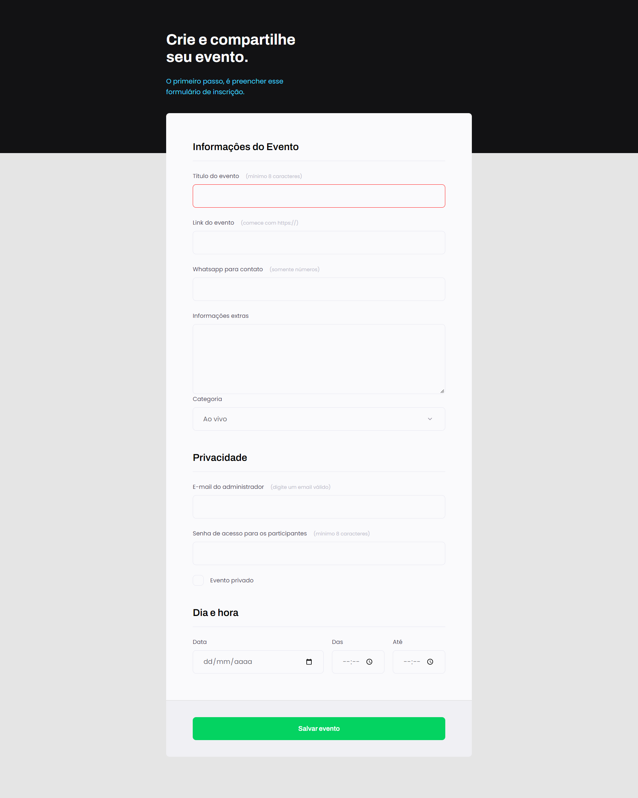

# Projeto 03: Crie seu evento

### Acesse o projeto: [Aqui](https://jonasncsantos.github.io/Treine.me/)
## Sobre
Projeto desenvolvido durante aula para aplicação dos conhencimentos ensinados no curso Explorer da [Rocketseat](https://www.rocketseat.com.br/") no Stage 03.

## Aprendizados
- Formularios
- Tipos de input
- Agrupamento de input
- Customização de campos de input
- Acessibilidade
- Navegação por teclado
- Tipos de envios de dados 
- Pseudo-elements
- Pseudo-classes
- Validação de campos